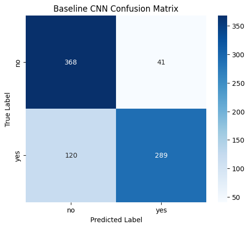
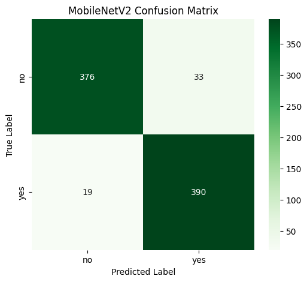
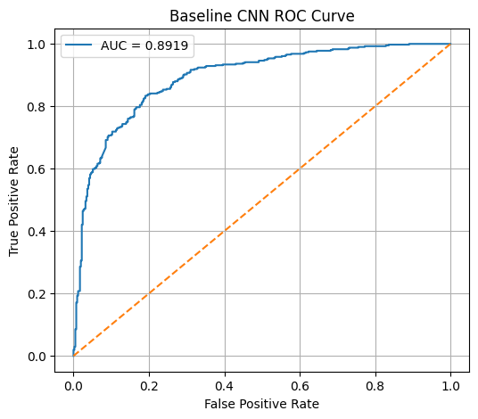
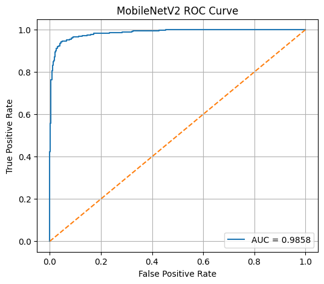
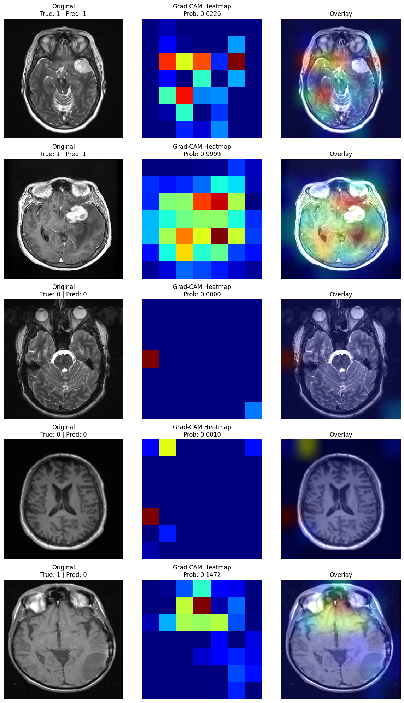

# Explainable Brain Tumour Classification from MRI

An end-to-end academic deep-learning study comparing a custom convolutional neural network with MobileNetV2 transfer learning for binary brain MRI classification. The repository combines reproducible notebooks, quantitative evaluation and Grad-CAM explanations.


## Research question

How effectively can transfer learning improve tumour-positive versus non-tumour MRI classification relative to a custom CNN, and can Grad-CAM provide useful qualitative evidence about the image regions influencing predictions?

## Study design

- **Dataset:** 5,450 MRI images from the [Brain Tumor MRI - Yes or No dataset](https://www.kaggle.com/datasets/mohamada2274/brain-tumor-mri-yes-or-no)
- **Classes:** 2,725 tumour-positive and 2,725 non-tumour images
- **Split:** stratified 70/15/15, yielding 3,814 training, 818 validation and 818 test images
- **Input:** RGB-compatible images resized to 224 x 224 pixels
- **Models:** custom CNN and ImageNet-pretrained MobileNetV2
- **Evaluation:** accuracy, precision, recall, F1-score, confusion matrix and ROC AUC
- **Explainability:** Grad-CAM case visualisations


## Main results

Results below are from the archived 818-image test split documented in the executed notebook and accompanying portfolio.

| Model | Accuracy | Precision | Recall | F1-score | ROC AUC |
| --- | ---: | ---: | ---: | ---: | ---: |
| Baseline CNN | 80.32% | 87.58% | 70.66% | 78.21% | 0.8919 |
| MobileNetV2 | **93.64%** | **92.20%** | **95.35%** | **93.75%** | **0.9858** |

MobileNetV2 reduced false negatives from 120 to 19 and improved recall by 24.69 percentage points relative to the baseline CNN.

### Evaluation evidence

| Baseline CNN | MobileNetV2 |
| --- | --- |
|  |  |
|  |  |

### Explainability



Grad-CAM is used here as a qualitative interpretability aid. It does not establish clinical localisation accuracy or causal importance.

## Repository guide

| Resource | Purpose |
| --- | --- |
| [`Brain_Tumour_Detection_from_MRI_Images_Using_Convolutional_Neural_Networks_and_Transfer_Learning_(Final_Version).ipynb`](Brain_Tumour_Detection_from_MRI_Images_Using_Convolutional_Neural_Networks_and_Transfer_Learning_%28Final_Version%29.ipynb) | Structured final workflow |
| [`Brain_tumour_classification.ipynb`](Brain_tumour_classification.ipynb) | Executed exploratory record and result provenance |
| [`figures/`](figures) | Curated evaluation and explainability figures |
| [`results/model-metrics.csv`](results/model-metrics.csv) | Machine-readable comparison table |
| [`paper/`](paper) | Academic portfolio describing the study |
| [`MODEL_CARD.md`](MODEL_CARD.md) | Intended use, limitations and evaluation context |

## Reproducing the analysis

1. Create a Python environment and install the dependencies:

   ```bash
   pip install -r requirements.txt
   ```

2. Download the dataset from Kaggle. Keep it outside version control and preserve its `yes` and `no` class folders.
3. Open the final notebook in Jupyter or Google Colab.
4. Set the dataset path in the configuration section.
5. Run the dataset audit, split construction, training, evaluation and Grad-CAM sections in order.

A CUDA-capable GPU is recommended. Exact numerical reproduction can vary with TensorFlow, CUDA and hardware versions; preserve the notebook seeds and package environment when comparing runs.

## Limitations and responsible use

- Evaluation uses a single curated dataset and one stratified image-level split; no external hospital cohort was tested.
- Image-level splitting cannot establish patient-level independence when patient identifiers are unavailable.
- Grad-CAM heatmaps were not compared with radiologist-annotated tumour regions.
- Performance may shift across scanners, acquisition protocols, institutions and patient populations.
- This repository is an academic prototype, not a medical device. It must not be used for diagnosis, treatment or patient-care decisions.

The dataset archive is intentionally not redistributed here. Users must obtain it from the original source and follow its licence and usage conditions. The repository currently does not declare an open-source licence.

## Author

**Abdur Rahman Siam**  
MSc Cybersecurity Technology | Explainable AI, digital health and trustworthy machine learning

- [ORCID](https://orcid.org/0009-0002-5904-9477)
- [LinkedIn](https://www.linkedin.com/in/abdur-rahman-siam-86a705353)

## Citation

If this repository supports your work, cite it using [`CITATION.cff`](CITATION.cff).
